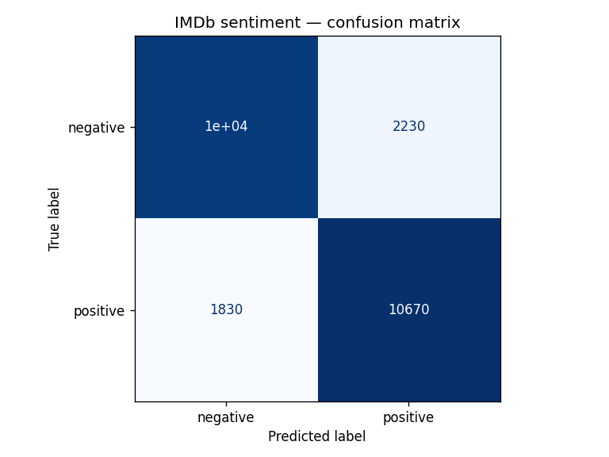
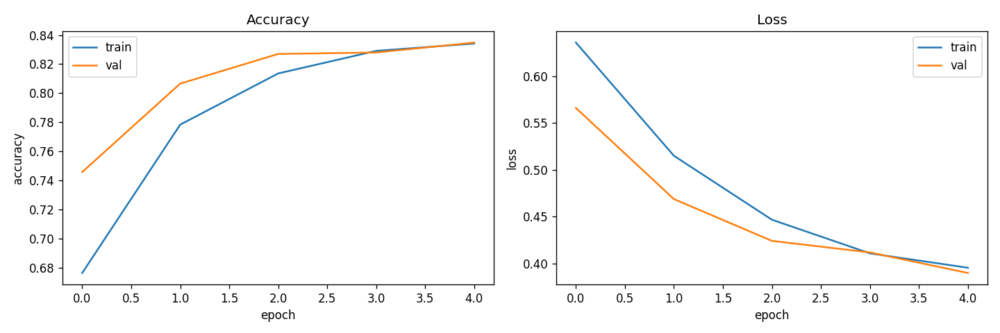
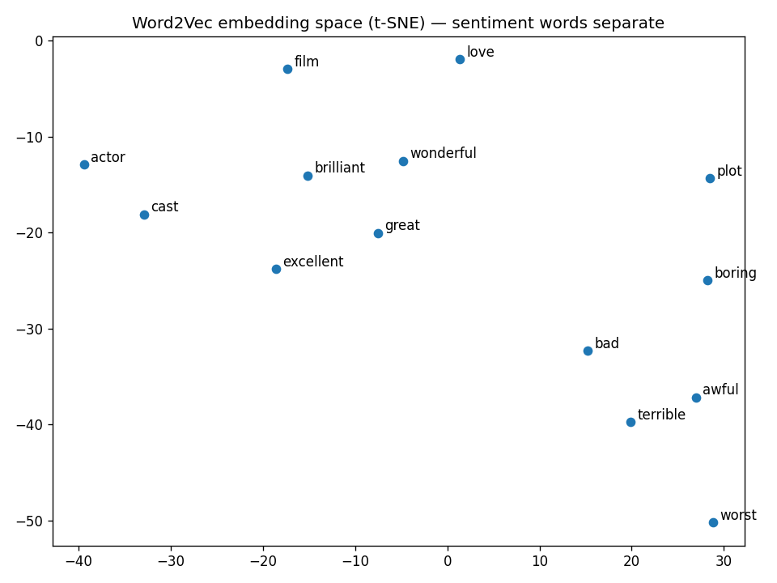

# Sentiment DL — a deep-learning build of the COMP9727 Tutorial 5 pipeline

Tutorial 5 is a linear notebook: load IMDb → train Word2Vec → feed a frozen
embedding layer into a `Flatten → Dense` MLP → plot one accuracy curve. This
project re-implements the **same idea the way an ML engineer would ship it**:
leakage-free train/val/test splits, an architecture **bake-off**, full
classification metrics, embedding diagnostics, config, tests, and orchestration.

**Task:** binary sentiment classification on 50,000 IMDb movie reviews, using
Word2Vec embeddings trained from scratch as the input layer to a neural network.

## Results

Full run (`python run_pipeline.py`), three disjoint splits
(20k train / 5k val / 25k test):

| Architecture | Validation accuracy |
|---|---|
| `mlp` — Flatten → Dense *(the tutorial)* | 0.814 |
| **`pool` — GlobalAveragePooling → Dense** ⭐ winner | **0.838** |
| `lstm` — LSTM → Dense | 0.819 |

**Held-out test set (winner = `pool`): accuracy 0.838, F1 0.840.**

The bake-off makes a concrete point: the tutorial's `Flatten` layer turns a
300×100 embedding into 30,000 position-dependent inputs and over-fits; swapping
it for an order-invariant **global average pooling** layer both shrinks the model
and *beats* it on validation. That is the kind of result you only get by
comparing architectures instead of accepting the first one that trains.

| Confusion matrix | Training curves | Embedding space (t-SNE) |
|---|---|---|
|  |  |  |

The t-SNE plot answers one of the tutorial's discussion questions visually:
positive words (*great, excellent, brilliant*) cluster apart from negative ones
(*awful, terrible, boring*), confirming the Word2Vec space learned sentiment.

## What this adds over the tutorial

| Area | Tutorial | This project |
|---|---|---|
| **Data splits** | train + test only — every choice tuned on test ❌ | **train / val / test**; Word2Vec + model fit on train, val for selection, test touched once ✅ |
| **Embedding leakage** | implicit (no val set) | Word2Vec trained on **train reviews only** |
| **Architecture** | one `Flatten → Dense` MLP | **bake-off**: MLP vs GlobalAvgPool vs LSTM |
| **Metrics** | accuracy curve only | accuracy, **precision / recall / F1**, confusion matrix |
| **Embedding analysis** | t-SNE of 9 words, inline | t-SNE saved as a report; vocab-coverage check |
| **Engineering** | hardcoded values | **YAML config**, model persistence, **unit tests**, Makefile, `--quick` smoke mode |
| **Reproducibility** | manual cells | one command, seeded, artifacts to disk |

## Layout
```
config/config.yaml   all knobs (vocab, maxlen, embedding + model hyperparams)
src/
  config.py          config loader
  data.py            IMDb load/decode + leakage-free train/val/test split
  embeddings.py      Word2Vec training, embedding matrix, t-SNE
  model.py           three Keras architectures (mlp / pool / lstm)
  evaluate.py        metrics, confusion matrix, training-curve + t-SNE plots
run_pipeline.py      end-to-end orchestration (+ --quick smoke mode)
tests/               unit tests for the deterministic wiring
docs/                committed sample plots (shown above)
```

## Run it
```bash
cd sentiment_dl
python -m venv .venv && source .venv/bin/activate
pip install -r requirements.txt     # or: make install
python run_pipeline.py              # full run (or: make run)
python run_pipeline.py --quick      # fast smoke test on a subset (make quick)
make test                           # unit tests
```

## Where to take it next
- Compare from-scratch Word2Vec against **pretrained GloVe / fastText** vectors.
- Replace Word2Vec + pooling with a **fine-tuned transformer** (DistilBERT) and
  measure the accuracy/latency trade-off.
- Add a **FastAPI `/predict`** endpoint + a small **Streamlit** demo so the model
  is clickable, and an **MLflow** run log for the bake-off.
- Sweep the Word2Vec `window` / `sg` (skip-gram vs CBOW) and report the effect on
  downstream accuracy (the tutorial's open question, answered empirically).

---
*Built on COMP9727 (Recommender Systems) Tutorial 5. The tutorial supplies the
problem; the engineering, evaluation, and architecture comparison here are my
own.*
